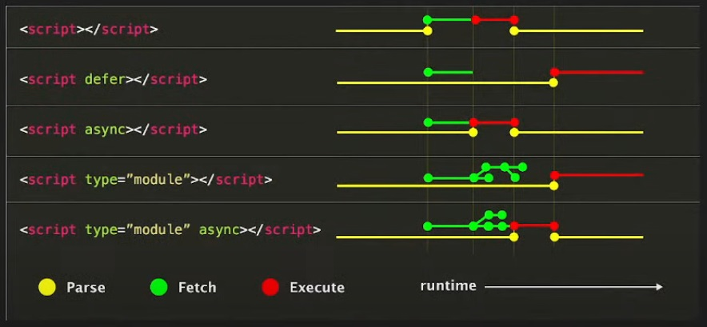

# Clase05

# ejercicios

* Van a crear los objetos de la clase pasada ahora tienen que tener el render
    - Video
    - Audio
    - Imagen
    - Botón
    - Lista de elementos

* Crear un objeto formulario de ingreso de registro que use algunos componentes mencionados arriba.

## opcional

* Crear el objeto/class/componente input que si el ingreso de datos es incorrecto se ponga en
rojo sino en amarillo y un check al costado.
    - Input